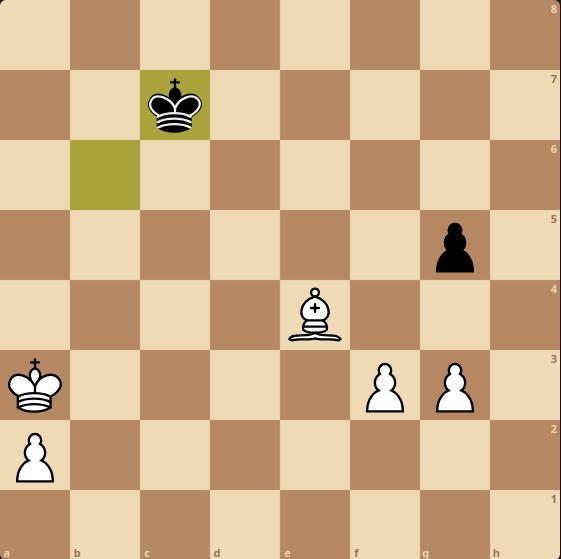

Press a piece to show legal moves, then choose or clip off to reset

  
  
  
  
  
  
  
  

  
  
  
  
  
  
  
  

  
  
  
  
  
  
  
  

  
  
  
  
  
  
  
  

  
  
  
  
  
  
  
  

  
  
  
  
  
  
  
  

  
  
  
  
  
  
  
  

  
  
  
  
  
  
  
  

    ---

    ### ⚙️ Server Logic Transition

    To move this to **dynamic mode**, you will replace the absolute static image URL (`https://raw.githubusercontent.com/.../FILE.png`) with your server's dynamic endpoint:

    **Static URL (Testing):**
    `https://raw.githubusercontent.com/AragornOfKebroyd/Github-Chess/main/images/kdl.png`

    **Dynamic URL (Production Goal):**
    `https://fictional-orbit-67v7r47r9q9f57wx-5000.app.github.dev/square_img?game=abc123&sq=e8`

    

    <map name="grid">
        <!-- 8x8 grid: cells are 70x70 pixels -->
        <area shape="rect" coords="0,0,70,70" alt="cell 1,1" href="https://example.com/cell-1-1">
        <area shape="rect" coords="70,0,140,70" alt="cell 1,2" href="https://example.com/cell-1-2">
        <area shape="rect" coords="140,0,210,70" alt="cell 1,3" href="https://example.com/cell-1-3">
        <area shape="rect" coords="210,0,280,70" alt="cell 1,4" href="https://example.com/cell-1-4">
        <area shape="rect" coords="280,0,350,70" alt="cell 1,5" href="https://example.com/cell-1-5">
        <area shape="rect" coords="350,0,420,70" alt="cell 1,6" href="https://example.com/cell-1-6">
        <area shape="rect" coords="420,0,490,70" alt="cell 1,7" href="https://example.com/cell-1-7">
        <area shape="rect" coords="490,0,560,70" alt="cell 1,8" href="https://example.com/cell-1-8">
        <area shape="rect" coords="0,70,70,140" alt="cell 2,1" href="https://example.com/cell-2-1">
        <area shape="rect" coords="70,70,140,140" alt="cell 2,2" href="https://example.com/cell-2-2">
        <area shape="rect" coords="140,70,210,140" alt="cell 2,3" href="https://example.com/cell-2-3">
        <area shape="rect" coords="210,70,280,140" alt="cell 2,4" href="https://example.com/cell-2-4">
        <area shape="rect" coords="280,70,350,140" alt="cell 2,5" href="https://example.com/cell-2-5">
        <area shape="rect" coords="350,70,420,140" alt="cell 2,6" href="https://example.com/cell-2-6">
        <area shape="rect" coords="420,70,490,140" alt="cell 2,7" href="https://example.com/cell-2-7">
        <area shape="rect" coords="490,70,560,140" alt="cell 2,8" href="https://example.com/cell-2-8">
        <area shape="rect" coords="0,140,70,210" alt="cell 3,1" href="https://example.com/cell-3-1">
        <area shape="rect" coords="70,140,140,210" alt="cell 3,2" href="https://example.com/cell-3-2">
        <area shape="rect" coords="140,140,210,210" alt="cell 3,3" href="https://example.com/cell-3-3">
        <area shape="rect" coords="210,140,280,210" alt="cell 3,4" href="https://example.com/cell-3-4">
        <area shape="rect" coords="280,140,350,210" alt="cell 3,5" href="https://example.com/cell-3-5">
        <area shape="rect" coords="350,140,420,210" alt="cell 3,6" href="https://example.com/cell-3-6">
        <area shape="rect" coords="420,140,490,210" alt="cell 3,7" href="https://example.com/cell-3-7">
        <area shape="rect" coords="490,140,560,210" alt="cell 3,8" href="https://example.com/cell-3-8">
        <area shape="rect" coords="0,210,70,280" alt="cell 4,1" href="https://example.com/cell-4-1">
        <area shape="rect" coords="70,210,140,280" alt="cell 4,2" href="https://example.com/cell-4-2">
        <area shape="rect" coords="140,210,210,280" alt="cell 4,3" href="https://example.com/cell-4-3">
        <area shape="rect" coords="210,210,280,280" alt="cell 4,4" href="https://example.com/cell-4-4">
        <area shape="rect" coords="280,210,350,280" alt="cell 4,5" href="https://example.com/cell-4-5">
        <area shape="rect" coords="350,210,420,280" alt="cell 4,6" href="https://example.com/cell-4-6">
        <area shape="rect" coords="420,210,490,280" alt="cell 4,7" href="https://example.com/cell-4-7">
        <area shape="rect" coords="490,210,560,280" alt="cell 4,8" href="https://example.com/cell-4-8">
        <area shape="rect" coords="0,280,70,350" alt="cell 5,1" href="https://example.com/cell-5-1">
        <area shape="rect" coords="70,280,140,350" alt="cell 5,2" href="https://example.com/cell-5-2">
        <area shape="rect" coords="140,280,210,350" alt="cell 5,3" href="https://example.com/cell-5-3">
        <area shape="rect" coords="210,280,280,350" alt="cell 5,4" href="https://example.com/cell-5-4">
        <area shape="rect" coords="280,280,350,350" alt="cell 5,5" href="https://example.com/cell-5-5">
        <area shape="rect" coords="350,280,420,350" alt="cell 5,6" href="https://example.com/cell-5-6">
        <area shape="rect" coords="420,280,490,350" alt="cell 5,7" href="https://example.com/cell-5-7">
        <area shape="rect" coords="490,280,560,350" alt="cell 5,8" href="https://example.com/cell-5-8">
        <area shape="rect" coords="0,350,70,420" alt="cell 6,1" href="https://example.com/cell-6-1">
        <area shape="rect" coords="70,350,140,420" alt="cell 6,2" href="https://example.com/cell-6-2">
        <area shape="rect" coords="140,350,210,420" alt="cell 6,3" href="https://example.com/cell-6-3">
        <area shape="rect" coords="210,350,280,420" alt="cell 6,4" href="https://example.com/cell-6-4">
        <area shape="rect" coords="280,350,350,420" alt="cell 6,5" href="https://example.com/cell-6-5">
        <area shape="rect" coords="350,350,420,420" alt="cell 6,6" href="https://example.com/cell-6-6">
        <area shape="rect" coords="420,350,490,420" alt="cell 6,7" href="https://example.com/cell-6-7">
        <area shape="rect" coords="490,350,560,420" alt="cell 6,8" href="https://example.com/cell-6-8">
        <area shape="rect" coords="0,420,70,490" alt="cell 7,1" href="https://example.com/cell-7-1">
        <area shape="rect" coords="70,420,140,490" alt="cell 7,2" href="https://example.com/cell-7-2">
        <area shape="rect" coords="140,420,210,490" alt="cell 7,3" href="https://example.com/cell-7-3">
        <area shape="rect" coords="210,420,280,490" alt="cell 7,4" href="https://example.com/cell-7-4">
        <area shape="rect" coords="280,420,350,490" alt="cell 7,5" href="https://example.com/cell-7-5">
        <area shape="rect" coords="350,420,420,490" alt="cell 7,6" href="https://example.com/cell-7-6">
        <area shape="rect" coords="420,420,490,490" alt="cell 7,7" href="https://example.com/cell-7-7">
        <area shape="rect" coords="490,420,560,490" alt="cell 7,8" href="https://example.com/cell-7-8">
        <area shape="rect" coords="0,490,70,560" alt="cell 8,1" href="https://example.com/cell-8-1">
        <area shape="rect" coords="70,490,140,560" alt="cell 8,2" href="https://example.com/cell-8-2">
        <area shape="rect" coords="140,490,210,560" alt="cell 8,3" href="https://example.com/cell-8-3">
        <area shape="rect" coords="210,490,280,560" alt="cell 8,4" href="https://example.com/cell-8-4">
        <area shape="rect" coords="280,490,350,560" alt="cell 8,5" href="https://example.com/cell-8-5">
        <area shape="rect" coords="350,490,420,560" alt="cell 8,6" href="https://example.com/cell-8-6">
        <area shape="rect" coords="420,490,490,560" alt="cell 8,7" href="https://example.com/cell-8-7">
        <area shape="rect" coords="490,490,560,560" alt="cell 8,8" href="https://example.com/cell-8-8">
</map>

    